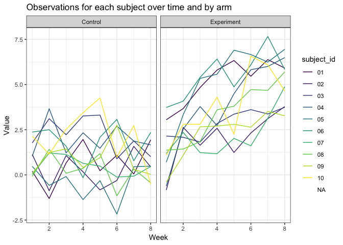

P8105\_hw5\_tj2383
================
Tanvi Jain
11/5/2018

Problem 1
---------

In this code chunk I read in the data and created the dataset along with the variables for control/experiment arm, subject ID, and value. Then I unnested the `value` variable to separate out the weeks and I aggregated across weeks to tidy the data. Lastly, I renamed the values under the `arm` variable and specified them as Control or Experiment.

``` r
data = list.files(path = "./data", full.names = TRUE)

longitudinal_data =
  tibble(
    arm = str_detect(data, "con"),
    subject_id = str_extract(data, "\\d+(?=.csv)"),
    value = map(data, read_csv)
  )
```

    ## Parsed with column specification:
    ## cols(
    ##   week_1 = col_double(),
    ##   week_2 = col_double(),
    ##   week_3 = col_double(),
    ##   week_4 = col_double(),
    ##   week_5 = col_double(),
    ##   week_6 = col_double(),
    ##   week_7 = col_double(),
    ##   week_8 = col_double()
    ## )
    ## Parsed with column specification:
    ## cols(
    ##   week_1 = col_double(),
    ##   week_2 = col_double(),
    ##   week_3 = col_double(),
    ##   week_4 = col_double(),
    ##   week_5 = col_double(),
    ##   week_6 = col_double(),
    ##   week_7 = col_double(),
    ##   week_8 = col_double()
    ## )
    ## Parsed with column specification:
    ## cols(
    ##   week_1 = col_double(),
    ##   week_2 = col_double(),
    ##   week_3 = col_double(),
    ##   week_4 = col_double(),
    ##   week_5 = col_double(),
    ##   week_6 = col_double(),
    ##   week_7 = col_double(),
    ##   week_8 = col_double()
    ## )
    ## Parsed with column specification:
    ## cols(
    ##   week_1 = col_double(),
    ##   week_2 = col_double(),
    ##   week_3 = col_double(),
    ##   week_4 = col_double(),
    ##   week_5 = col_double(),
    ##   week_6 = col_double(),
    ##   week_7 = col_double(),
    ##   week_8 = col_double()
    ## )
    ## Parsed with column specification:
    ## cols(
    ##   week_1 = col_double(),
    ##   week_2 = col_double(),
    ##   week_3 = col_double(),
    ##   week_4 = col_double(),
    ##   week_5 = col_double(),
    ##   week_6 = col_double(),
    ##   week_7 = col_double(),
    ##   week_8 = col_double()
    ## )
    ## Parsed with column specification:
    ## cols(
    ##   week_1 = col_double(),
    ##   week_2 = col_double(),
    ##   week_3 = col_double(),
    ##   week_4 = col_double(),
    ##   week_5 = col_double(),
    ##   week_6 = col_double(),
    ##   week_7 = col_double(),
    ##   week_8 = col_double()
    ## )
    ## Parsed with column specification:
    ## cols(
    ##   week_1 = col_double(),
    ##   week_2 = col_double(),
    ##   week_3 = col_double(),
    ##   week_4 = col_double(),
    ##   week_5 = col_double(),
    ##   week_6 = col_double(),
    ##   week_7 = col_double(),
    ##   week_8 = col_double()
    ## )
    ## Parsed with column specification:
    ## cols(
    ##   week_1 = col_double(),
    ##   week_2 = col_double(),
    ##   week_3 = col_double(),
    ##   week_4 = col_double(),
    ##   week_5 = col_double(),
    ##   week_6 = col_double(),
    ##   week_7 = col_double(),
    ##   week_8 = col_double()
    ## )
    ## Parsed with column specification:
    ## cols(
    ##   week_1 = col_double(),
    ##   week_2 = col_double(),
    ##   week_3 = col_double(),
    ##   week_4 = col_double(),
    ##   week_5 = col_double(),
    ##   week_6 = col_double(),
    ##   week_7 = col_double(),
    ##   week_8 = col_double()
    ## )
    ## Parsed with column specification:
    ## cols(
    ##   week_1 = col_double(),
    ##   week_2 = col_double(),
    ##   week_3 = col_double(),
    ##   week_4 = col_double(),
    ##   week_5 = col_double(),
    ##   week_6 = col_double(),
    ##   week_7 = col_double(),
    ##   week_8 = col_double()
    ## )
    ## Parsed with column specification:
    ## cols(
    ##   week_1 = col_double(),
    ##   week_2 = col_double(),
    ##   week_3 = col_double(),
    ##   week_4 = col_double(),
    ##   week_5 = col_double(),
    ##   week_6 = col_double(),
    ##   week_7 = col_double(),
    ##   week_8 = col_double()
    ## )
    ## Parsed with column specification:
    ## cols(
    ##   week_1 = col_double(),
    ##   week_2 = col_double(),
    ##   week_3 = col_double(),
    ##   week_4 = col_double(),
    ##   week_5 = col_double(),
    ##   week_6 = col_double(),
    ##   week_7 = col_double(),
    ##   week_8 = col_double()
    ## )
    ## Parsed with column specification:
    ## cols(
    ##   week_1 = col_double(),
    ##   week_2 = col_double(),
    ##   week_3 = col_double(),
    ##   week_4 = col_double(),
    ##   week_5 = col_double(),
    ##   week_6 = col_double(),
    ##   week_7 = col_double(),
    ##   week_8 = col_double()
    ## )

    ## Parsed with column specification:
    ## cols(
    ##   week_1 = col_double(),
    ##   week_2 = col_double(),
    ##   week_3 = col_double(),
    ##   week_4 = col_double(),
    ##   week_5 = col_double(),
    ##   week_6 = col_double(),
    ##   week_7 = col_integer(),
    ##   week_8 = col_double()
    ## )

    ## Parsed with column specification:
    ## cols(
    ##   week_1 = col_double(),
    ##   week_2 = col_double(),
    ##   week_3 = col_double(),
    ##   week_4 = col_double(),
    ##   week_5 = col_double(),
    ##   week_6 = col_double(),
    ##   week_7 = col_double(),
    ##   week_8 = col_double()
    ## )
    ## Parsed with column specification:
    ## cols(
    ##   week_1 = col_double(),
    ##   week_2 = col_double(),
    ##   week_3 = col_double(),
    ##   week_4 = col_double(),
    ##   week_5 = col_double(),
    ##   week_6 = col_double(),
    ##   week_7 = col_double(),
    ##   week_8 = col_double()
    ## )
    ## Parsed with column specification:
    ## cols(
    ##   week_1 = col_double(),
    ##   week_2 = col_double(),
    ##   week_3 = col_double(),
    ##   week_4 = col_double(),
    ##   week_5 = col_double(),
    ##   week_6 = col_double(),
    ##   week_7 = col_double(),
    ##   week_8 = col_double()
    ## )
    ## Parsed with column specification:
    ## cols(
    ##   week_1 = col_double(),
    ##   week_2 = col_double(),
    ##   week_3 = col_double(),
    ##   week_4 = col_double(),
    ##   week_5 = col_double(),
    ##   week_6 = col_double(),
    ##   week_7 = col_double(),
    ##   week_8 = col_double()
    ## )
    ## Parsed with column specification:
    ## cols(
    ##   week_1 = col_double(),
    ##   week_2 = col_double(),
    ##   week_3 = col_double(),
    ##   week_4 = col_double(),
    ##   week_5 = col_double(),
    ##   week_6 = col_double(),
    ##   week_7 = col_double(),
    ##   week_8 = col_double()
    ## )
    ## Parsed with column specification:
    ## cols(
    ##   week_1 = col_double(),
    ##   week_2 = col_double(),
    ##   week_3 = col_double(),
    ##   week_4 = col_double(),
    ##   week_5 = col_double(),
    ##   week_6 = col_double(),
    ##   week_7 = col_double(),
    ##   week_8 = col_double()
    ## )

    ## Parsed with column specification:
    ## cols(
    ##   uid = col_character(),
    ##   reported_date = col_integer(),
    ##   victim_last = col_character(),
    ##   victim_first = col_character(),
    ##   victim_race = col_character(),
    ##   victim_age = col_character(),
    ##   victim_sex = col_character(),
    ##   city = col_character(),
    ##   state = col_character(),
    ##   lat = col_double(),
    ##   lon = col_double(),
    ##   disposition = col_character()
    ## )

``` r
longitudinal_data_clean = longitudinal_data %>% 
  unnest() %>% 
  gather(key = "week", week_1:week_8, value = "value") %>% 
  mutate(week = as.numeric(str_extract(week, "\\d")))

longitudinal_data_clean$arm = as.character(longitudinal_data_clean$arm)
longitudinal_data_clean$arm[longitudinal_data_clean$arm == "TRUE"] = "Control"
longitudinal_data_clean$arm[longitudinal_data_clean$arm == "FALSE"] = "Experiment"
```

The following spaghetti plot shows observations on each subject over time according to the control or experiment arm.

``` r
longitudinal_data_clean %>% 
  ggplot(aes(x = week, y = value, color = subject_id)) +
    geom_line() +
    facet_grid(~arm) +
    viridis::scale_color_viridis(
      discrete = TRUE,
      name = "subject_id"
    ) +
    labs(
      x = "Week",
      y = "Value",
      title = "Observations for each subject over time and by arm"
    ) +
    theme_bw()
```

    ## Warning: Removed 417432 rows containing missing values (geom_path).

 From this plot it is clear that the values for those in the experiment arm fluctuate but are overall increasing over time. However, for the control arm we see that the values fluctuate but remain low over time.

Problem 2
---------

Reading in the homicide data and calculating some descriptive statistics to describe the dataset.

``` r
homicide_data = read.csv("./data/homicide-data.csv")

homicide_data %>% 
  nrow()
```

    ## [1] 52179

``` r
homicide_data %>% 
  ncol()
```

    ## [1] 12

``` r
homicide_data %>% 
  select(victim_age) %>% 
  head(1)
```

    ##   victim_age
    ## 1         78

``` r
homicide_data %>% 
  select(victim_sex) %>% 
  head(1)
```

    ##   victim_sex
    ## 1       Male

``` r
homicide_data %>% 
  select(victim_first, victim_last) %>% 
  head(1)
```

    ##   victim_first victim_last
    ## 1         JUAN      GARCIA

``` r
homicide_data %>% 
  select(city, state) %>% 
  head(1)
```

    ##          city state
    ## 1 Albuquerque    NM

``` r
homicide_data %>% 
  select(disposition) %>% 
  head(1)
```

    ##             disposition
    ## 1 Closed without arrest

This dataset contains information on homicides from 50 cities across the United States over a decade. The Washington Post has identified the places where murder is common but arrests are rare. The dataset contains 52179 reports on homicides and 12 variables. The key variables include victim's last name (`victim_last`), victim's first name (`victim_first`), race of the victim (`victim_race`), victim's age (`victim_age`), victim's sex (`victim_sex`), `city` of homicide, `state` of homicide, and the `disposition`. The following is an example of this data: This victim is a Male of 78 age and his name is JUAN, GARCIA. The homicide occurred in Albuquerque, NM and the status of the case is Closed without arrest.

In this code chunk, I create a `city_state` variable. Then I created a new dataset called total\_homicides that summarizes within cities to obtain the total number of homicides and the number of unsolved homicides (those for which the disposition is “Closed without arrest” or “Open/No arrest”).

``` r
homicide_data_combined = 
  homicide_data %>% 
  mutate(city_state = paste(city, state, sep = ", ")) %>% 
  select(-city, -state)

total_homicides = 
  homicide_data_combined %>% 
  group_by(city_state) %>% 
  summarize(total_homicides = n(), unsolved_homicides = sum(disposition == "Closed without arrest" | disposition == "Open/No arrest"))
```

In this code chunk I calculate the proportion of homicides that are unsolved for Baltimore.

``` r
baltimore_homicides =
  total_homicides %>% 
  filter(city_state == "Baltimore, MD")
  
prop = 
  prop.test(x = baltimore_homicides$unsolved_homicides,
            n = baltimore_homicides$total_homicides) %>% 
  broom::tidy() %>% 
  select(estimate, conf.low, conf.high)
prop$estimate
```

    ## [1] 0.6455607

``` r
prop$conf.low
```

    ## [1] 0.6275625

``` r
prop$conf.high
```

    ## [1] 0.6631599

The estimated proportion of unsolved cases in Baltimore is 0.6455607 and the 95% confidence interval is from 0.6275625 to 0.6631599.

In this code chunk I created a dataset with the estimated proportion of unsolved cases and corresponding 95% CIs for each city.

``` r
prop_unsolved = function(x, y) {
   est_prop = 
     prop.test(x = x, n = y) %>% 
     broom::tidy() %>% 
     select(estimate, conf.low, conf.high)
}

homicides =
  map2(.x = total_homicides$unsolved_homicides, 
       .y = total_homicides$total_homicides, 
       ~prop_unsolved(.x, .y)) %>% 
  bind_rows() %>% 
  bind_cols(total_homicides) %>% 
  mutate(conf_low = conf.low,
         conf_high = conf.high) %>% 
  select(city_state, total_homicides, unsolved_homicides, estimate, conf_low, conf_high)
```

    ## Warning in prop.test(x = x, n = y): Chi-squared approximation may be
    ## incorrect

The following is a plot of the estimated proportions of unsolved cases with their respective CIs for each city.

``` r
homicides %>% 
  mutate(city_state = forcats::fct_inorder(city_state)) %>% 
  ggplot(aes(x = city_state, y = estimate)) +
  geom_point() +
  geom_errorbar(aes(ymin = conf_low, ymax = conf_high)) +
  labs(
    x = "city_state",
    y = "estimated proportions of unsolved cases",
    title = "Estimated proportion of unsolved cases in the U.S."
  ) +
  theme_bw() +
  theme(axis.text.x = element_text(angle = 90, size = 7))
```


